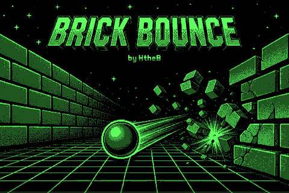
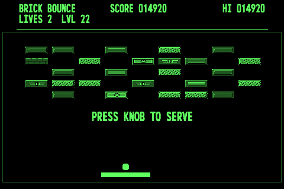
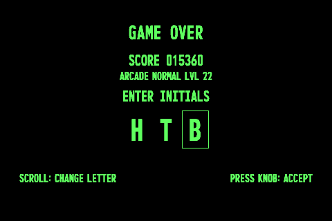

# Brick Bounce

Brick Bounce is an original arcade brick-breaker for the Pip-Boy 3000. Clear 50
hand-built levels, collect power-ups, chase high scores, and unlock extra
content as you master the game.

## Screenshots

## Features

- 50 main levels plus bonus rounds every 10 levels.
- Arcade and Classic ball behavior, with Easy, Normal, Hard, and Insane
  difficulties.
- Three independent save profiles, automatic save points, local high scores,
  optional QR score uploads, and custom level editing.
- Power-ups including paddle size, Power Ball, Multi Ball, Extra Life, Fast
  Ball, Slow Ball, and random items.
- Unlockable bonus content: PONG, Snake, Floaty Ball, Bounce Run, a music
  player, and custom levels.
- An attract-mode demo, animated About screen, original title artwork, and four
  in-game music tracks.

## Controls

| Input                        | Action                                                |
| ---------------------------- | ----------------------------------------------------- |
| Turn a scroll wheel          | Move the paddle; navigate menus; change values        |
| Press the left knob          | Serve the ball, select an item, pause, or confirm     |
| Turn the second scroll wheel | Alternate menu navigation and secondary game controls |
| PONG two-player mode         | One player uses each scroll wheel                     |

The relevant screen always shows the available action. The game uses the term
**KNOB** consistently for a press.

Only non-cheated scores may be uploaded. Select **HIGH SCORES** then
**ONLINE** to open the public Pip-Boy leaderboard QR code.

## Installation

This holotape is intended for the Pip-Boy 3000 Holotapes repository and
Pip-Boy.com. The `metadata.json` `storage` list declares every file that must be
installed under `HOLO/BRKBNCE/`.

For repository development, place this directory at `holotapes/BrickBounce/`,
run `npm install`, then run `npm run build` from the repository root. The
repository build generates the registry entry; do not hand-edit
`holotapes/registry.json`.

## Firmware Tested

- Pip-Boy 3000 firmware 1.1.5
- Espruino 2v29.350

## Credits

- Game design, final direction, artwork, and music selection: HtheB

## License

Copyright (c) 2026 HtheB.

Brick Bounce is licensed under the
[PolyForm Noncommercial License 1.0.0](LICENSE). It may be used, modified, and
shared for noncommercial purposes under those terms.

[NOTICE](NOTICE) grants Pip-Boy.com a limited additional permission to host,
distribute, and maintain Brick Bounce while accepting voluntary donations that
support the site's hosting and operation. That permission does not grant other
commercial rights to Brick Bounce.

## Source and Assets

`app.js` is the readable deferred launcher. `source/MAIN.JS` contains the
complete readable title-screen and main-menu module; the rest of the readable
runtime pages are in `source/`. `app.min.js` and the `.JS` files in `assets/`
are the matching Espruino runtime files used on the device. The `.BIN`
title/secret screen data and `.AVI` About videos are runtime art assets.
